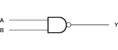
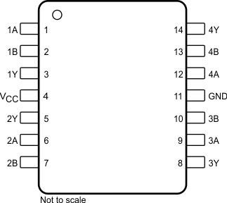

# 7400 #

## Features ##
Quadruple 2-Input Positive-NAND Gates

|     |     |
| --- | --- |
| Number of channels | 4 |
| Inputs per channel | 2 |

## Documentation ##
[7400](https://www.ti.com/document-viewer/sn7400/datasheet)

##  Applications ##

## Description ##

## PIN Layout ##

## Truth Table ##
| A | B | Y |
|---|---|---|
| 0 | 0 | 1 |
| 0 | 1 | 1 |
| 1 | 0 | 1 |
| 1 | 1 | 0 |